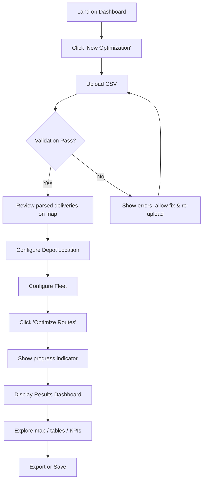

# Dynamic Multi-Vehicle Logistics Route Optimization Platform

## Implementation Plan — Combined PRD / SRS / Roadmap

---

## 1. Product Understanding

### 1.1 Problem Statement

Logistics companies manually assign deliveries to vehicles and decide routes — a process that is slow, error-prone, and produces sub-optimal plans. As delivery volumes grow, manual planning becomes a bottleneck that directly impacts fuel costs, delivery times, and fleet utilization.

### 1.2 Solution

A web-based platform that accepts a delivery list, depot location, and fleet configuration, then automatically generates optimized multi-vehicle delivery routes. The output is presented through interactive maps, dashboards, and tabular summaries designed for dispatchers and managers.

### 1.3 Target Users

| Persona | Role | Needs |
|---|---|---|
| **Dispatcher** | Day-to-day route planning | Fast plan generation, clear delivery sequences, printable manifests |
| **Fleet Manager** | Vehicle allocation & utilization | KPIs, utilization metrics, cost analysis |
| **Operations Manager** | Strategic oversight | Historical trends, comparative analytics, export capabilities |

### 1.4 Key Assumptions & Challenges

- Users provide **addresses, not coordinates** — the system must geocode transparently.
- Geocoding APIs have rate limits and costs — caching and batching are critical.
- The VRP (Vehicle Routing Problem) is NP-hard — heuristic/metaheuristic solvers are needed.
- Users are non-technical — the UX must abstract all complexity.

---

## 2. Functional Requirements

### 2.1 Core Requirements

| ID | Requirement | Priority |
|---|---|---|
| FR-01 | Upload delivery data via CSV | P0 |
| FR-02 | Validate CSV schema, addresses, and demand values | P0 |
| FR-03 | Configure depot location (address or map pin) | P0 |
| FR-04 | Configure fleet: vehicle types, count per type, capacity per type | P0 |
| FR-05 | Geocode all addresses (depot + deliveries) automatically | P0 |
| FR-06 | Solve the Capacitated VRP and produce optimized routes | P0 |
| FR-07 | Display optimization summary (total distance, vehicles used, utilization) | P0 |
| FR-08 | Display interactive map with color-coded routes per vehicle | P0 |
| FR-09 | Display per-vehicle route summary with ordered delivery sequence | P0 |
| FR-10 | Display delivery sequence table with ETA estimates | P0 |

### 2.2 Extended Requirements

| ID | Requirement | Priority |
|---|---|---|
| FR-11 | Export results as PDF / CSV | P1 |
| FR-12 | Save and reload past optimization sessions | P1 |
| FR-13 | Download per-vehicle delivery manifest | P1 |
| FR-14 | Provide a sample CSV template for download | P1 |
| FR-15 | Show geocoding failures and allow manual correction | P1 |
| FR-16 | Display operational KPIs dashboard | P1 |
| FR-17 | Allow drag-and-drop route editing post-optimization | P2 |
| FR-18 | User authentication and multi-tenant support | P2 |

---

## 3. User Journey

### 3.1 Primary Flow (Happy Path)



### 3.2 Step-by-Step Detail

1. **Landing**: Dashboard shows past optimizations (if any) and a prominent "New Optimization" CTA.
2. **Upload**: Drag-and-drop or file picker. System validates immediately and shows a preview table.
3. **Validation Feedback**: Inline row-level errors (missing fields, invalid demand, duplicate IDs). User can fix CSV and re-upload.
4. **Depot Config**: Map with search bar. User types address or clicks on map. Pin is draggable.
5. **Fleet Config**: Card-based UI. Add vehicle types (name, capacity, count). Presets for common configurations.
6. **Optimization**: Progress bar with estimated time. Backend solves CVRP asynchronously.
7. **Results**: Tabbed interface — Summary, Map, Vehicle Routes, Delivery Table, KPIs.
8. **Export**: PDF report, CSV of routes, per-vehicle manifests.

---

## 4. Feature Breakdown

### 4.1 CSV Upload & Validation

**Required CSV Columns:**
| Column | Type | Rules |
|---|---|---|
| `delivery_id` | String | Unique, non-empty |
| `address` | String | Non-empty, geocodable |
| `demand` | Number | Positive integer, ≤ max vehicle capacity |

**Optional Columns (future-ready):**
- `priority` (high/medium/low)
- `time_window_start`, `time_window_end`
- `notes`

**Validation Rules:**
- File must be `.csv` with UTF-8 encoding.
- Maximum file size: 5 MB.
- Maximum rows: 500 (Phase 1), 2000 (Phase 2).
- Header row required; column names case-insensitive.
- No duplicate `delivery_id` values.
- `demand` must be a positive number; zero or negative rejected.
- Empty rows silently skipped; partially filled rows flagged as errors.
- Addresses validated during geocoding phase (post-upload).

### 4.2 Geocoding

- Use a geocoding API (e.g., OpenRouteService, Nominatim, Google Maps) to convert addresses → coordinates.
- **Cache** geocoded results in the database to reduce API calls.
- Batch requests where the API supports it.
- Present failed geocodes to the user with options: edit address, pin on map manually, or skip delivery.
- Store both original address and resolved coordinates.

### 4.3 Depot Configuration

- Search bar with autocomplete (powered by geocoding API).
- Interactive map for visual placement.
- Draggable pin for fine-tuning.
- Option to save a default depot for repeat use.

### 4.4 Fleet Configuration

- Add multiple vehicle types (e.g., "Small Van — 50 units", "Truck — 200 units").
- Per type: name, capacity, count.
- Total fleet capacity must be ≥ total demand (validated with clear error message).
- Presets: "Standard Fleet", "Small Business", custom.
- Fleet configs saveable for reuse.

### 4.5 Route Optimization Engine

**Algorithm Approach:**
- Model as a **Capacitated Vehicle Routing Problem (CVRP)**.
- Use **Google OR-Tools** (open-source, production-grade) as the primary solver.
- Distance matrix computed via OSRM or OpenRouteService (road-network distances, not Euclidean).
- Solver strategies: cheapest arc insertion + guided local search metaheuristic.
- Configurable solver time limit (default 30s, max 120s).

**Solver Inputs:**
- Distance/duration matrix (all-pairs: depot + deliveries).
- Demand per delivery.
- Vehicle capacities and count.
- Depot index.

**Solver Outputs:**
- Assignment of deliveries to vehicles.
- Ordered sequence per vehicle.
- Per-route distance and estimated duration.
- Unassigned deliveries (if any, with reasons).

### 4.6 Results & Visualization

**Summary Card:**
- Total distance, total duration, vehicles used vs. available, average utilization %, unserved deliveries.

**Interactive Map:**
- Color-coded polylines per vehicle route.
- Numbered markers showing delivery sequence.
- Depot marker (distinct icon).
- Click marker → delivery details popup.
- Toggle routes on/off per vehicle.
- Fit-to-bounds on load.

**Vehicle Route Cards:**
- Per vehicle: route distance, duration, load utilization bar, delivery count.
- Expandable ordered delivery list.

**Delivery Sequence Table:**
- Sortable/filterable table: delivery ID, address, assigned vehicle, sequence #, estimated arrival.

**KPI Dashboard:**
- Fleet utilization gauge chart.
- Distance distribution bar chart.
- Load distribution per vehicle.
- Efficiency score (deliveries per km).

---

## 5. UI / Page Planning

### 5.1 Page Map

| Page | Purpose | Key Components |
|---|---|---|
| **Dashboard** | Landing page, session history | Stats cards, recent optimizations list, "New" CTA |
| **Upload** | CSV upload & validation | Drag-drop zone, preview table, error panel |
| **Configure** | Depot + fleet setup | Split view: map (left) + fleet cards (right) |
| **Optimizing** | Progress feedback | Progress bar, animated truck, cancel button |
| **Results** | Full results display | Tab bar: Summary / Map / Routes / Table / KPIs |
| **History** | Past sessions | Searchable list with date, delivery count, status |

### 5.2 Responsive Design

- Primary target: desktop (1280px+) — dispatchers use desktop workstations.
- Tablet-friendly layouts for the results page.
- Mobile: read-only results viewing (not a planning interface).

### 5.3 Design Principles

- **Wizard-style flow** with a stepper for Upload → Configure → Optimize → Results.
- Inline validation with real-time feedback.
- Dark/light theme support.
- Accessible (WCAG 2.1 AA).
- Loading states for all async operations.

---

## 6. System Architecture

### 6.1 High-Level Architecture

```
┌──────────────┐       ┌──────────────┐       ┌──────────────────┐
│   Frontend   │◄─────►│   Backend    │◄─────►│  Optimization    │
│   (React)    │  REST  │   (Python    │  IPC   │  Worker          │
│              │  API   │    FastAPI)  │       │  (OR-Tools)      │
└──────────────┘       └──────┬───────┘       └──────────────────┘
                              │
                    ┌─────────┼─────────┐
                    ▼         ▼         ▼
              ┌─────────┐ ┌────────┐ ┌──────────┐
              │PostgreSQL│ │ Redis  │ │Geocoding │
              │          │ │(cache/ │ │  API     │
              │          │ │ queue) │ │(external)│
              └─────────┘ └────────┘ └──────────┘
```

### 6.2 Technology Choices

| Layer | Technology | Rationale |
|---|---|---|
| Frontend | React + TypeScript + Vite | Component-based, large ecosystem, fast builds |
| Mapping | Leaflet + OpenStreetMap | Free, no API key, excellent interactivity |
| Backend | Python + FastAPI | Async-native, excellent for data processing, OR-Tools is Python-native |
| Solver | Google OR-Tools | Industry-standard open-source CVRP solver |
| Distance Matrix | OSRM (self-hosted) or OpenRouteService | Real road distances, free |
| Database | PostgreSQL | Robust, supports JSON, geospatial (PostGIS) |
| Cache / Queue | Redis | Geocode cache, optimization job queue |
| Geocoding | Nominatim (self-hosted) or OpenRouteService | Free, no API key limits |
| Containerization | Docker + Docker Compose | Reproducible environments |

### 6.3 API Design (Key Endpoints)

| Method | Endpoint | Purpose |
|---|---|---|
| `POST` | `/api/v1/upload` | Upload & validate CSV |
| `GET` | `/api/v1/uploads/{id}/preview` | Get parsed delivery preview |
| `POST` | `/api/v1/geocode` | Geocode delivery addresses |
| `POST` | `/api/v1/optimize` | Start optimization job |
| `GET` | `/api/v1/optimize/{job_id}/status` | Poll job status |
| `GET` | `/api/v1/optimize/{job_id}/results` | Get optimization results |
| `GET` | `/api/v1/sessions` | List past sessions |
| `GET` | `/api/v1/sessions/{id}` | Get session details |
| `POST` | `/api/v1/export/{job_id}` | Generate export (PDF/CSV) |

---

## 7. Module Breakdown

### 7.1 Frontend Modules

| Module | Responsibility |
|---|---|
| `upload/` | CSV upload, parsing, validation UI, preview table |
| `configure/` | Depot map picker, fleet configuration cards |
| `optimize/` | Progress tracking, status polling |
| `results/` | Summary cards, map visualization, route cards, tables, KPIs |
| `history/` | Past session list and detail views |
| `common/` | Shared components (stepper, buttons, modals, charts) |
| `api/` | API client layer with error handling |
| `store/` | State management (Zustand or React Context) |

### 7.2 Backend Modules

| Module | Responsibility |
|---|---|
| `api/` | FastAPI route handlers, request/response schemas |
| `services/csv_service` | CSV parsing, schema validation, sanitization |
| `services/geocoding_service` | Address → coordinate resolution, caching, batch processing |
| `services/distance_service` | Distance/duration matrix computation via OSRM |
| `services/optimization_service` | OR-Tools CVRP solver wrapper, job management |
| `services/export_service` | PDF/CSV report generation |
| `models/` | SQLAlchemy ORM models |
| `schemas/` | Pydantic request/response schemas |
| `workers/` | Background job execution (optimization, geocoding) |
| `core/` | Config, logging, error handling, middleware |

---

## 8. Edge Cases & Validation

### 8.1 Input Edge Cases

| Case | Handling |
|---|---|
| Empty CSV | Reject with "No deliveries found" |
| Single delivery | Valid; assign to one vehicle, direct route |
| All deliveries at same address | Valid; optimize vehicle assignment by capacity |
| Demand exceeds all vehicle capacities | Reject delivery with clear error |
| Total demand > total fleet capacity | Warning; solver will leave deliveries unassigned |
| Duplicate addresses | Valid; each delivery is independent |
| International addresses | Support via geocoding; flag if outside service area |
| Special characters in addresses | Sanitize before geocoding |
| CSV with extra columns | Ignore extra columns; warn user |
| Very large demand spread | Valid; solver handles heterogeneous demand |

### 8.2 Geocoding Edge Cases

| Case | Handling |
|---|---|
| Address not found | Flag for manual correction (map pin or edit) |
| Ambiguous address (multiple results) | Show top 3 candidates; user selects |
| Geocoding API timeout | Retry with exponential backoff (max 3) |
| Geocoding API rate limit | Queue and throttle requests |
| Depot address not found | Block optimization until resolved |

### 8.3 Optimization Edge Cases

| Case | Handling |
|---|---|
| Solver timeout | Return best solution found so far with warning |
| No feasible solution | Show clear explanation (e.g., insufficient capacity) |
| Unassigned deliveries | List them separately with reasons |
| Single vehicle fleet | Solve as TSP (simpler, faster) |
| Very large delivery set (500+) | Cluster first, then optimize per cluster |

---

## 9. User Experience Recommendations

### 9.1 Onboarding
- Provide a **sample CSV** download on the upload page.
- Include an interactive **guided tour** (tooltip walkthrough) on first use.
- Show a **demo optimization** with pre-loaded data for new users.

### 9.2 Feedback & Transparency
- Show **real-time validation** as CSV is parsed (progress bar + row count).
- Display geocoding progress with a map that plots points as they resolve.
- Show solver progress (iterations, current best distance) during optimization.
- Always explain **why** deliveries were unassigned.

### 9.3 Error Recovery
- Never lose user data on error — allow retry without re-upload.
- Allow editing individual addresses that failed geocoding.
- Allow adjusting fleet config and re-optimizing without re-uploading.

### 9.4 Dispatcher Workflow
- **One-click re-optimize** after fleet changes.
- **Print-friendly** per-vehicle manifests with delivery sequence, addresses, and notes.
- **Keyboard shortcuts** for power users (next vehicle, toggle map layers).

### 9.5 Visual Design
- Use a **professional logistics aesthetic** — clean, data-dense, not playful.
- Color-code vehicles consistently across map, cards, and tables.
- Use **micro-animations** for route drawing on map (polyline animation).
- Utilization bars with gradient fills (green → yellow → red).

---

## 10. Scalability Considerations

### 10.1 Computational Scaling

| Deliveries | Strategy |
|---|---|
| 1–100 | Direct CVRP solve (~5s) |
| 100–500 | CVRP with time limit 30–60s |
| 500–2000 | Cluster-first-route-second: k-means → per-cluster CVRP |
| 2000+ | Decomposition + parallel solving on worker pool |

### 10.2 Infrastructure Scaling

- **Horizontal**: Stateless backend behind load balancer; optimization workers scale independently.
- **Queue-based**: Redis queue decouples API from heavy computation.
- **Caching**: Geocode cache prevents redundant API calls; distance matrix cache for repeated depot locations.
- **Database**: Connection pooling; read replicas for dashboard queries if needed.

### 10.3 Data Scaling

- Archive old sessions to cold storage after 90 days.
- Paginate session history API.
- Lazy-load map data (cluster markers at high zoom levels).

---

## 11. Phased Implementation Roadmap

### Phase 1 — Foundation (Weeks 1–3)

> Goal: End-to-end working prototype with core optimization.

| Week | Deliverables |
|---|---|
| **1** | Project scaffolding (React + FastAPI + Docker Compose). Database schema. CSV upload & validation backend. Upload UI with preview. |
| **2** | Geocoding service with caching. Distance matrix service (OSRM). Depot configuration UI with map. Fleet configuration UI. |
| **3** | OR-Tools CVRP solver integration. Async job execution. Results API. Results UI: summary cards + interactive map + route cards. |

**Phase 1 Exit Criteria:** Upload CSV → configure depot & fleet → get optimized routes on a map.

### Phase 2 — Polish & Usability (Weeks 4–5)

| Deliverable | Details |
|---|---|
| Delivery sequence table | Sortable, filterable, with estimated arrival times |
| KPI dashboard | Charts: utilization gauges, distance distribution, efficiency metrics |
| Export | PDF report + CSV route export + per-vehicle manifest |
| Geocoding error handling | Manual correction UI (edit address, pin on map) |
| Session persistence | Save/load past optimizations |
| Sample data & onboarding | Sample CSV, guided tour, demo dataset |

### Phase 3 — Robustness & Scale (Weeks 6–7)

| Deliverable | Details |
|---|---|
| Cluster-first-route-second | For 500+ delivery sets |
| Performance optimization | Worker pool, caching, lazy loading |
| Error handling hardening | Retry logic, graceful degradation, comprehensive error messages |
| Testing | Unit tests (solver, geocoding), integration tests (API), E2E tests (Playwright) |
| Monitoring | Structured logging, health checks, basic metrics |

### Phase 4 — Advanced Features (Weeks 8–10)

| Deliverable | Details |
|---|---|
| User authentication | JWT-based auth, multi-user support |
| Route editing | Drag-and-drop reordering post-optimization with distance recalculation |
| Historical analytics | Trends over time, fleet efficiency tracking |
| Dark mode | Full theme support |
| Mobile responsive results | Read-only results on mobile devices |

---

## 12. Risks & Mitigation

| Risk | Impact | Likelihood | Mitigation |
|---|---|---|---|
| **Geocoding API unreliability** | Blocks entire workflow | Medium | Self-host Nominatim; implement multi-provider fallback chain |
| **Solver performance on large sets** | Poor UX, timeouts | Medium | Cluster-first approach; configurable time limits; show best-so-far |
| **OSRM distance matrix scaling** | O(n²) API calls | High | Batch matrix API; cache common depot matrices; limit delivery count |
| **Address quality from users** | Failed geocoding | High | Fuzzy matching; suggest corrections; manual pin fallback |
| **Scope creep** | Delayed delivery | Medium | Strict phase gates; P0-only in Phase 1 |
| **Browser performance with large maps** | Sluggish UI | Low | Canvas renderer for Leaflet; marker clustering; virtual scrolling for tables |

---

## 13. Success Metrics

| Metric | Target | Measurement |
|---|---|---|
| **Time to first optimization** | < 5 minutes from landing | Session timing |
| **Optimization solve time** | < 30s for 100 deliveries | Backend instrumentation |
| **Route quality** | Within 15% of optimal (for known benchmarks) | Solver benchmarking |
| **Geocoding success rate** | > 95% on first attempt | Geocoding service metrics |
| **User task completion rate** | > 90% upload → results | Funnel analytics |
| **Fleet utilization improvement** | > 20% vs. naive assignment | A/B comparison |
| **CSV upload error rate** | < 10% of uploads have schema errors | Upload service metrics |

---

## 14. Recommended Improvements Beyond Spec

### 14.1 High-Value Additions

1. **Reverse Geocoding on Map Click** — Let users click the map to add ad-hoc deliveries without CSV.
2. **What-If Analysis** — "What if I add 1 more truck?" — re-optimize with modified fleet and compare side-by-side.
3. **Cost Estimation** — Input fuel cost per km; show estimated delivery cost per route and total.
4. **Address Book** — Store frequently used delivery addresses for auto-complete in future uploads.
5. **Batch Geocoding Status** — Real-time map that plots delivery pins as geocoding completes.

### 14.2 Architecture Recommendations

1. **Event-Driven Optimization** — Use WebSockets (not polling) for real-time optimization progress.
2. **Plugin Architecture for Solvers** — Abstract the solver interface so OR-Tools can be swapped for commercial solvers (e.g., Gurobi) or ML-based approaches.
3. **Separation of Distance Matrix** — Treat the distance matrix as a standalone cached service; it's the most expensive computation and the most reusable.
4. **API-First Design** — Every UI action goes through the REST API; this enables future CLI tools, integrations, and mobile apps.

### 14.3 Future Architecture Alignment

The proposed architecture naturally supports the future vision:

| Future Feature | Architectural Hook |
|---|---|
| Time windows | Add constraints to solver; extend CSV schema |
| Multiple depots | Extend solver model; multi-depot UI |
| Live traffic | Swap static distance matrix for real-time API |
| Dynamic re-optimization | WebSocket push; solver re-run with updated inputs |
| Driver mobile app | API-first backend is ready; add mobile auth |
| GPS tracking | Add tracking service; WebSocket vehicle position stream |
| Enterprise integrations | REST API serves as integration surface |

---

## 15. Data Model (Conceptual)

### Core Entities

```
Session
├── id (UUID)
├── name
├── created_at
├── status (draft | optimizing | completed | failed)
├── depot_address
├── depot_lat, depot_lng
├── fleet_config (JSON)
└── optimization_result (JSON)

Delivery
├── id (UUID)
├── session_id (FK)
├── delivery_id (from CSV)
├── address (original)
├── lat, lng (geocoded)
├── demand
├── geocode_status (pending | success | failed | manual)
└── geocode_attempts

Route (derived, stored in optimization_result)
├── vehicle_type
├── vehicle_index
├── delivery_sequence (ordered list of delivery IDs)
├── total_distance
├── total_duration
├── total_load
└── utilization_pct
```

---

## 16. Testing Strategy

| Level | Scope | Tools |
|---|---|---|
| **Unit** | CSV parser, validation rules, solver wrapper, geocoding service | pytest, Jest/Vitest |
| **Integration** | API endpoints, database operations, geocoding + caching | pytest + httpx, TestContainers |
| **E2E** | Full user journey: upload → optimize → view results | Playwright |
| **Solver Benchmark** | Compare results against known CVRP benchmarks (e.g., Augerat) | Custom benchmark suite |
| **Load** | Distance matrix scaling, concurrent optimizations | Locust |

---

## Appendix A: CSV Template

```csv
delivery_id,address,demand
DEL001,"123 Main St, Springfield, IL 62701",10
DEL002,"456 Oak Ave, Springfield, IL 62702",25
DEL003,"789 Pine Rd, Springfield, IL 62703",15
```

## Appendix B: Glossary

| Term | Definition |
|---|---|
| **CVRP** | Capacitated Vehicle Routing Problem — optimization problem minimizing total travel distance with vehicle capacity constraints |
| **Depot** | Starting and ending location for all vehicles |
| **Demand** | Units of goods to deliver at each location |
| **Distance Matrix** | Pairwise travel distances between all locations |
| **OSRM** | Open Source Routing Machine — computes real road distances |
| **Geocoding** | Converting text addresses to geographic coordinates |
| **Metaheuristic** | Optimization strategy that explores solution space beyond local optima (e.g., simulated annealing, guided local search) |
